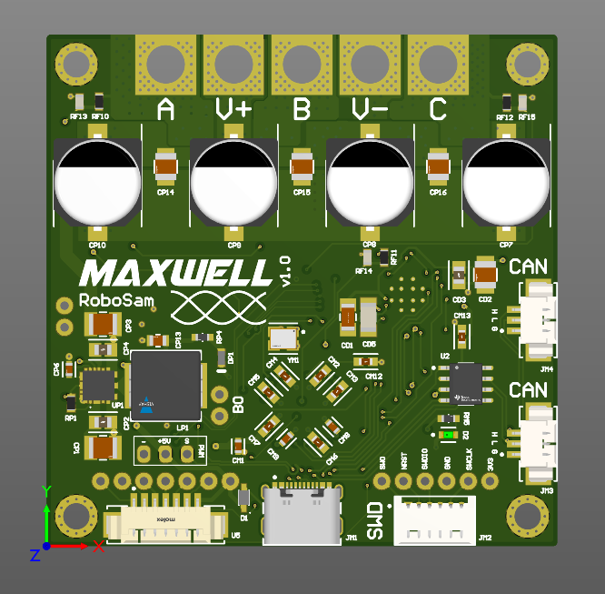

# Maxwell - An Open Source 3-Phase Motor Controller

---
## Specifications:
- Up to 60V input
- 70A Continuous current, 150A Peak
- PWM, CAN, and USB control
- Built in 5V BEC for radio recievers
- Sensorless, Sensored and FOC control
- Encoder support:
    - Hall sensors, Rotational encoders, Magnetic encoders (1 built in)

